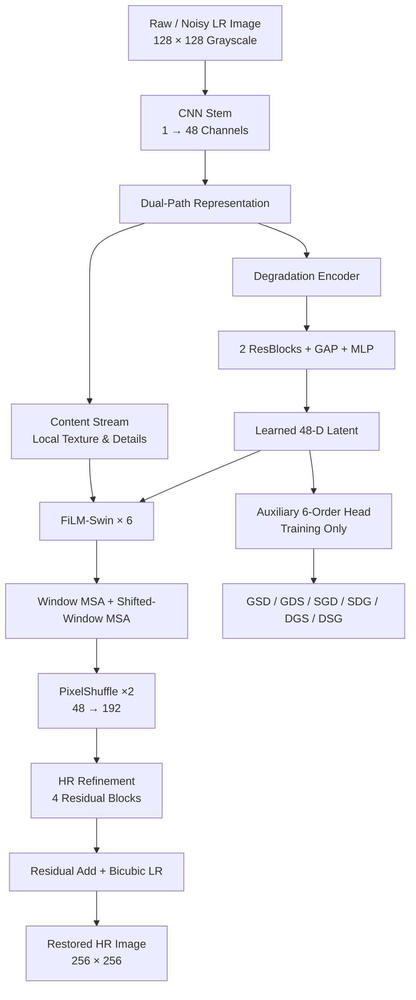
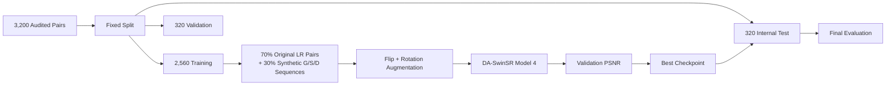
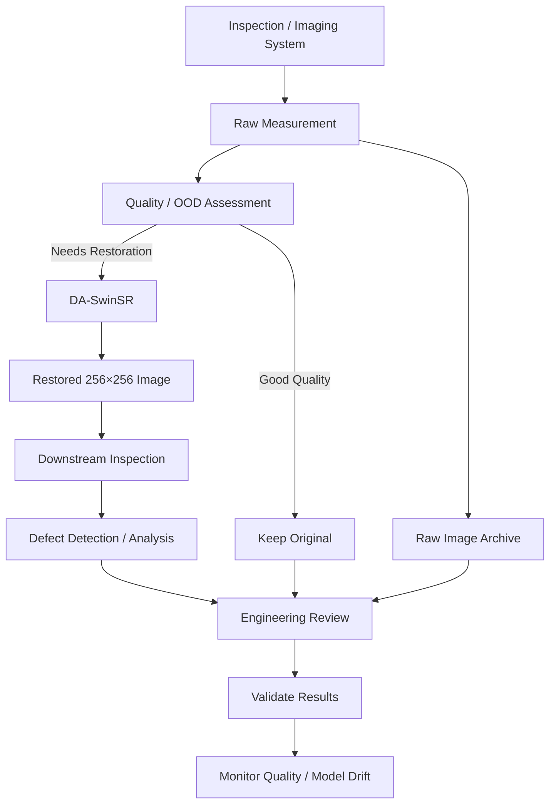

# TechnoVerse — DA-SwinSR Model 4

## AI-Based Restoration of Degraded Images for Semiconductor Inspection

DA-SwinSR Model 4 is an AI-based image-restoration system designed for semiconductor inspection images affected by **speckle noise, Gaussian corruption, and 2× spatial information loss** in different sequences.

The model converts a **128×128 grayscale degraded image** into a clearer **256×256 restored image**, while retaining the raw measurement for traceability and engineering review.

## 🌐 Live Demo

**Interactive Prototype:**  
https://techno-verse-da-swin-bhb07xgdg-prasham1706-1437s-projects.vercel.app/

**GitHub:**  
https://github.com/Prasham1706/TechnoVerse

---

## 🎯 Problem Statement

Semiconductor inspection images may contain:

- Speckle noise
- Gaussian corruption
- 2× spatial information loss / downsampling
- Different sequences of these degradations

The important challenge is that the **sequence of degradation operations matters**. The goal is therefore to build one efficient restoration model that can adapt to different degradation combinations instead of requiring a separate model for every sequence.

The original raw measurement is retained for traceability and engineering review.

---

# 🔄 End-to-End Flowchart



The architecture follows the Model 4 design in the project presentation: CNN stem, dual content/degradation paths, a learned 48-D latent, six FiLM-Swin blocks, PixelShuffle ×2, four residual blocks, and bicubic residual addition. fileciteturn0file0L36-L45 fileciteturn0file0L48-L76

---

# 🧠 Model Architecture

### Main pipeline

```text
Noisy LR 128×128
       ↓
CNN Stem (1 → 48)
       ↓
Dual Path
 ┌───────────────┬──────────────────┐
 ↓               ↓
Content        Degradation
Stream           Encoder
 ↓                 ↓
Local Details    48-D Latent
 └────────┬────────┘
          ↓
     FiLM-Swin ×6
          ↓
 Window MSA / SW-MSA
          ↓
 PixelShuffle ×2
          ↓
 HR Refinement
   4 ResBlocks
          ↓
Residual Add + Bicubic LR
          ↓
Restored 256×256
```

### Degradation Encoder

The degradation encoder uses:

```text
2 ResBlocks
     ↓
Global Average Pooling
     ↓
MLP
     ↓
48-D degradation representation
```

This learned representation produces the conditioning information used by the FiLM-Swin restoration blocks. fileciteturn0file0L70-L76

---

# 🔬 Degradation Orders

The system models three degradation operations:

| Symbol | Meaning |
|---|---|
| **G** | Gaussian corruption |
| **S** | Speckle noise |
| **D** | 2× spatial information loss / downsampling |

The six possible orders are:

```text
GSD
GDS
SGD
SDG
DGS
DSG
```

The six-order objective is used **only during training**. During deployment, restoration is automatic and **does not require the user to provide the degradation order**. fileciteturn0file0L72-L76

---

# ⚙️ Training Pipeline



The project uses a fixed **2,560 / 320 / 320 split** from 3,200 audited pairs. Training uses 70% original LR pairs and 30% synthetic G/S/D sequences, paired flip/rotation augmentation, AdamW, AMP, and 100 epochs. fileciteturn0file0L104-L114

### Loss Function

```text
Loss =
0.70 × L1
+ 0.20 × (1 − SSIM)
+ 0.10 × Sobel Edge Loss
+ 0.05 × Masked Order Cross-Entropy
```

The order-classification component is a training-time auxiliary objective. fileciteturn0file0L111-L113

---

# 🧪 Test Data

## Real Paired Internal Test

**N = 320 image pairs**

Reported results:

| Metric | Result |
|---|---:|
| PSNR | **28.8809 dB** |
| SSIM | **0.76624** |
| LPIPS | **0.27731** |
| PSNR improvement vs bicubic | **+6.33 dB** |
| SSIM improvement vs bicubic | **+0.2603** |

The presentation identifies this as the **real paired internal test** with N=320. fileciteturn0file0L92-L101

## Controlled Six-Order Benchmark

The model was also tested on matched synthetic degradations across all six G/S/D orders:

| Metric | Result |
|---|---:|
| Average PSNR | **32.08 dB** |
| PSNR range | **31.25–33.01 dB** |
| Average SSIM | **0.84012** |
| Per-order result | **All six orders >31 dB PSNR** |
| Synthetic samples | **320 per order** |

These controlled results are separate from the official 400-image competition evaluation. fileciteturn0file0L96-L101

### Held-Out Example

For real held-out sample **000090**:

- PSNR: **31.54 dB**
- SSIM: **0.8881**
- LPIPS: **0.2037**
- Improvement over bicubic: **+7.88 dB PSNR** fileciteturn0file0L99-L100

---

# 📊 Performance

| Property | Value |
|---|---:|
| Parameters | **571,327** |
| Inference time | **19.66 ms/image** |
| Peak model memory | **89.9 MB** |
| Input | **128×128 grayscale** |
| Output | **256×256** |
| Degradation sequences | **6** |
| Label required at inference | **No** |

These figures are reported in the project's Innovation and Uniqueness section. fileciteturn0file0L79-L89

---

# 🏭 Real-Time / Real-World Use

## 1. Semiconductor Inspection

The primary use case is semiconductor inspection, where captured images can contain speckle noise, Gaussian corruption, and spatial information loss. fileciteturn0file0L26-L33

```text
Inspection Camera
       ↓
Raw 128×128 Measurement
       ↓
DA-SwinSR
       ↓
Restored 256×256 Image
       ↓
Defect Analysis / Inspection
       ↓
Engineering Review
```

The raw image can remain available alongside the restored image for traceability.

## 2. Automated Optical Inspection

```text
Captured Inspection Image
          ↓
     DA-SwinSR
          ↓
Enhanced Image
          ↓
Defect Detection
          ↓
Pass / Review / Reject
```

The restored image can act as a preprocessing stage for downstream inspection and computer-vision models.

## 3. Industrial Machine Vision

```text
Industrial Camera
       ↓
Degraded Image
       ↓
Image Restoration
       ↓
Enhanced Image
       ↓
Vision Model / Human Inspection
```

## 4. Scientific / Microscopy Imaging

The architecture can potentially be adapted to scientific images affected by multiple degradation processes, subject to domain-specific validation.

## 5. Remote Sensing

The same restoration approach can potentially be applied to imagery affected by sensor noise and resolution loss before downstream analysis.

---

# 🔄 Practical Deployment Flowchart



The presentation describes this as a future quality loop: **retain raw → assess quality/OOD → restore or recapture → validate downstream → monitor drift**. fileciteturn0file0L84-L89

---

# 💡 Innovation & Uniqueness

### Input-Conditioned FiLM-Swin

A learned 48-D input representation produces FiLM scale/bias terms inside the Swin blocks, allowing the restoration path to adapt to each input. fileciteturn0file0L79-L83

### One Model for Six Orders

One compact network is stress-tested across all six G/S/D degradation sequences rather than using a separate model for each order. fileciteturn0file0L79-L88

### Label-Free Inference

The six-order objective provides training supervision, but the deployed restoration model does not require a degradation-order label. fileciteturn0file0L84-L88

### Compact and Fast

- **571,327 parameters**
- **19.66 ms/image**
- **89.9 MB peak model memory** fileciteturn0file0L84-L88

---

# 🛠️ Technology Stack

### Deep Learning

- Python
- PyTorch
- Swin Transformer
- CNN
- FiLM conditioning
- Residual learning
- PixelShuffle

### Evaluation

- PSNR
- SSIM
- LPIPS
- Sobel edge loss

### Deployment

- Web application
- Vercel
- Interactive restoration prototype

---

# 📁 Suggested Repository Structure

```text
TechnoVerse/
│
├── data/
│   ├── train/
│   ├── validation/
│   └── test/
│
├── models/
│   └── da_swinsr/
│
├── preprocessing/
│   └── degradation_pipeline/
│
├── training/
│   └── train.py
│
├── evaluation/
│   ├── eval.py
│   ├── psnr.py
│   ├── ssim.py
│   └── lpips.py
│
├── inference/
│   └── inference.py
│
├── frontend/
│
├── requirements.txt
└── README.md
```

---

# 🔍 Key Contributions

- Developed **DA-SwinSR Model 4** for degraded semiconductor inspection imagery.
- Combined **CNN local features** with **FiLM-conditioned Swin Transformer blocks**.
- Learned a **48-D degradation representation** from the input.
- Modeled all six G/S/D degradation sequences.
- Used a **training-only six-order auxiliary objective**.
- Reconstructed **256×256 images from 128×128 inputs**.
- Evaluated on a **320-image real paired internal test set**.
- Achieved **28.8809 dB PSNR, 0.76624 SSIM and 0.27731 LPIPS** on the internal test.
- Achieved **32.08 dB average PSNR and 0.84012 average SSIM** on the controlled six-order benchmark.
- Achieved **19.66 ms/image** measured inference time.
- Maintained a compact **571,327-parameter** model.
- Built an interactive web prototype for demonstration.

---

# ⚠️ Limitations

The current evidence is based on **one provided dataset**. The presentation notes:

- No cross-tool / cross-lot validation
- Available compute constrained broader ablation search
- The controlled synthetic results are not the official 400-image competition score

Further validation is required before production deployment across different semiconductor tools, lots, imaging conditions, and real-world degradation distributions. fileciteturn0file0L104-L114

The restored image should complement—not replace—the original raw measurement.

---

# 🚀 Future Improvements

- Validate across multiple semiconductor tools and manufacturing lots.
- Train on larger real-world datasets.
- Add additional degradation types.
- Improve OOD detection and quality assessment.
- Optimize inference using TensorRT or similar deployment technologies.
- Build a scalable inference API.
- Integrate restoration directly into semiconductor inspection pipelines.
- Benchmark downstream defect-detection performance.
- Add model-drift monitoring.
- Explore restoration for inspection video sequences.

---

# 👥 Team

**Team:** TechnoVerse • KLA PS01  
**College:** Pandit Deendayal Energy University

| Role | Member |
|---|---|
| Lead & Integration | Prasham Doshi |
| Data & Baselines | Darshil Mendapara |
| Swin & Evaluation | Dhruvi Singh |
| Order & Demo | Rudra Patel |

The team roles and members are listed on page 1 of the project presentation. fileciteturn0file0L2-L23

---

# 📚 References

1. i4C SEMICON India Hackathon 2026 — KLA PS01 official problem statement
2. Liang et al., **SwinIR: Image Restoration Using Swin Transformer**, ICCVW 2021
3. Perez et al., **FiLM**, AAAI 2018
4. Shi et al., **ESPCN / PixelShuffle**, CVPR 2016

---

# 🔗 Project Links

**Live Demo:**  
https://techno-verse-da-swin-bhb07xgdg-prasham1706-1437s-projects.vercel.app/

**GitHub:**  
https://github.com/Prasham1706/TechnoVerse

---

## ⭐ Summary

**DA-SwinSR Model 4** combines:

**Local CNN Features + Learned Degradation Conditioning + FiLM-Swin Attention + PixelShuffle Reconstruction + Residual Learning**

into one compact image-restoration system.

The key advantage is that the model handles **six different G/S/D degradation sequences without requiring a degradation-order label during inference**, while maintaining a fast measured inference time and a compact parameter count.

The project provides both a trained restoration pipeline and an interactive web prototype for demonstrating the approach.
